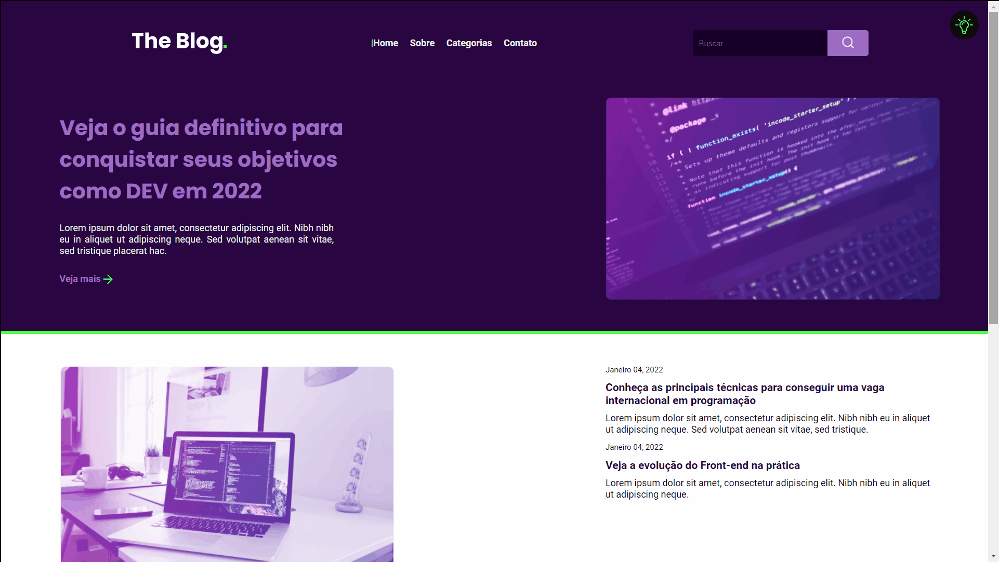

<h1 align="center">Rocketblog</h1>

Homepage de um blog genérico.
 
<h3 align="center"><a href="https://mienblack.github.io/rocketblog/" target="_blank"><strong>[ DÊ UMA OLHADA ]</strong></a></h3>

---

 

  

## 💻 Projeto

Neste projeto utilizo, ferramentas básicas para construção de um blog, com responsividade e troca de tema.

## 🚀 Tecnologias

As seguintes ferramentas foram usadas na construção do projeto:

- [JavaScript]
- [HTML]
- [CSS]

Made with 💟 by Damien Costa ✌🏿

<a href="https://www.linkedin.com/in/damien-costa-969953164/" target="_blank">
